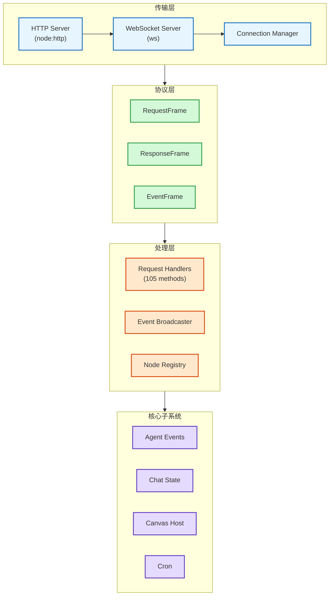
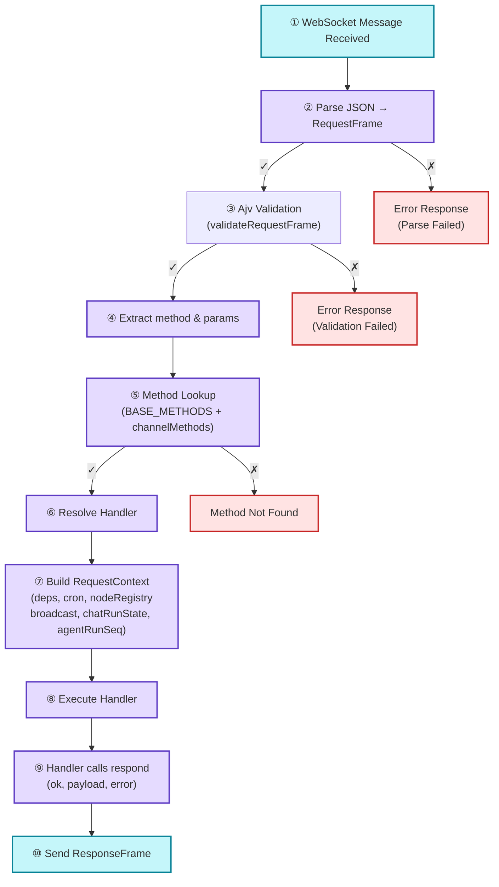
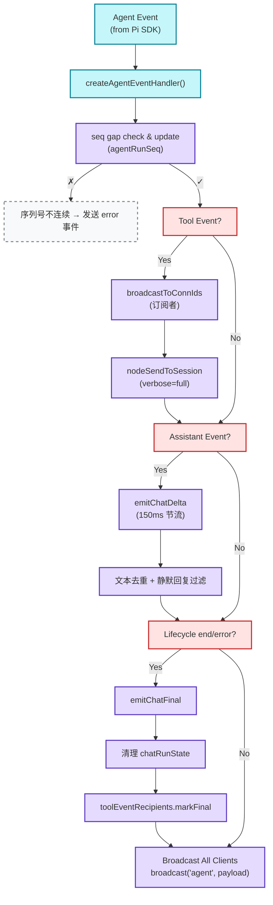
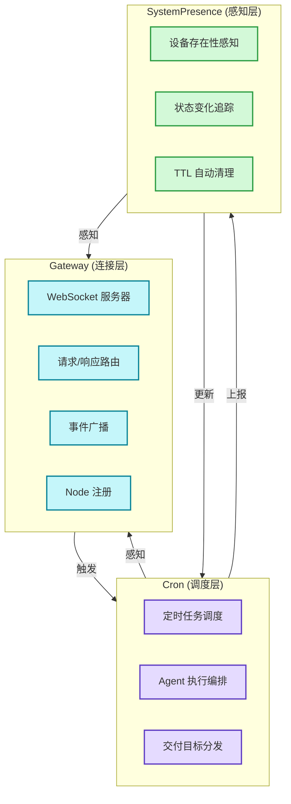

# Gateway 核心架构（事实对齐版）

本文以源码为依据，聚焦入口文件、方法分发、广播与节点注册等关键位置；避免臆测性的数字与实现细节，路径均为相对仓库根。

## 1. 目录与职责
- 启动与服务
  - 核心入口：src/gateway/server.impl.ts（启动 WS/HTTP、装配依赖）
  - HTTP/WS 支持：src/gateway/server-http.ts 及相关 ws 运行时文件
- 方法分发
  - 方法聚合与处理：src/gateway/server-methods.ts（整合各子系统 handler）
  - 方法清单：src/gateway/server-methods-list.ts（列出内置方法名，版本可能有差异）
- 广播与事件
  - 广播接口：src/gateway/server-broadcast.ts（全局/定向广播）
  - 聊天/增量推送：src/gateway/server-chat.ts（增量推送/清理）
- 节点与配对
  - 节点注册与调用：src/gateway/node-registry.ts（节点连接与调用分发）
- 认证与连接
  - 认证与握手：src/gateway/auth.ts、src/gateway/auth-rate-limit.ts

上述文件名称与结构可能随版本调整，请以实际仓库为准。

## 2. 典型请求路径（简化）
1) 客户端通过 WS/HTTP 建立连接（auth/握手见 src/gateway/auth.ts）
2) 收到请求帧后在 server-methods.ts 中解析方法名
3) 定位到对应 handler，注入上下文后执行
4) 通过 respond 回写响应；必要时触发广播

## 3. 广播与订阅（概念）
- 全局广播：向所有有效连接发送
- 定向广播：向某些连接集合发送（如与某运行相关的订阅者）
- 节流与清理：聊天/增量推送在 server-chat.ts 中实现，避免内存与渲染压力

## 4. 与 Agent/节点的关系
- Agent 事件：由 Gateway 接入后通过广播/定向推送给客户端
- 节点调用：通过 node-registry.ts 维护的注册表进行转发与回调

## 5. 查阅起点
- 启动：src/gateway/server.impl.ts
- 方法：src/gateway/server-methods.ts、src/gateway/server-methods-list.ts
- 广播：src/gateway/server-broadcast.ts、src/gateway/server-chat.ts
- 节点：src/gateway/node-registry.ts
- 认证：src/gateway/auth.ts

---

# Gateway 核心架构

> 基于 `src/gateway/` 源码分析

---

## 核心技术洞察（TL;DR）

Gateway 是 OpenClaw 的**心脏**，一个设计精妙的长运行服务。看完代码，只能说**卧槽，这作者确实有点东西**。

| 洞察 | 说明 |
|------|------|
| **三层抽象刀法精准** | Protocol → Handler → Subsystem，职责分离如手术刀般干净 |
| **双向索引 O(1)** | NodeRegistry 同时维护 nodeId↔connId，大多数人只会建一个 Map |
| **TTL + 宽限期设计精妙** | 工具事件订阅 10 分钟过期 + 30 秒收尾时间，踩过坑才能写出这个 |
| **增量节流 150ms** | 不是拍脑袋的数字，太快渲染吃力，太慢用户卡顿，实测调优的结果 |
| **序列号 gap 检测** | `agentRunSeq` 在检测事件丢失/乱序，这种细节很多人会忽略 |
| **背压控制的双刃剑** | `dropIfSlow` 保护服务端，但客户端可能错过关键事件，没有重传机制 |

**一句话总结**：Gateway 是一个**事件驱动的 RPC 总线 + WebSocket 推送系统**，用三层抽象把复杂性管理得井井有条。

---

## 一、Gateway 定位与架构全景

Gateway 不是简单的 WebSocket 服务器，它是 OpenClaw 的**中枢神经系统**。

**核心职责**：
- WebSocket 连接管理与生命周期控制
- 请求路由与处理器分发（105 个方法）
- 事件广播与消息推送
- Node 注册与远程调用（RPC）
- Agent 事件分发与聊天状态管理
- Canvas Host 集成



**Leon 评价**：这个架构图看着简单，但每一层都经过深思熟虑。三层抽象不是过度设计，而是**必要的复杂性隔离**。

---

## 二、协议层：三种帧，解决两个问题

**文件**: `src/gateway/protocol/index.ts`

Gateway 的协议层设计解决了两个根本问题：
1. **RPC 调用**：RequestFrame/ResponseFrame
2. **服务端推送**：EventFrame

```typescript
// 请求帧：客户端 → 服务端（RPC 调用）
type RequestFrame = {
  type: "request";
  id: string;
  method: string;  // 105 种方法之一
  params: Record<string, unknown>;
};

// 响应帧：服务端 → 客户端（RPC 返回）
type ResponseFrame = {
  type: "response";
  id: string;
  ok: boolean;
  payload?: unknown;
  error?: ErrorShape;
};

// 事件帧：服务端 → 客户端（主动推送）
type EventFrame = {
  type: "event";
  event: string;  // GATEWAY_EVENTS 之一
  payload?: unknown;
};
```

**设计点评**：

| 好的地方 | 问题点 |
|----------|--------|
| 请求/响应/事件分离清晰，职责单一 | EventFrame 没有确认机制，丢帧了客户端不知道 |
| Ajv 运行时验证，类型安全 | 验证失败时错误信息有时候不够直观 |
| JSON 格式可读性好，调试方便 | 二进制效率低，高频场景可能有问题 |

**Leon 洞察**：作者选择了 JSON 而不是 MessagePack，这是个正确的权衡。对于 Gateway 这种管理平面协议，**可读性比效率更重要**。真要优化性能，应该先看 profilter 数据，而不是上来就二进制。

---

## 三、请求处理器：105 个方法的组织艺术

**文件**: `src/gateway/server-methods/types.ts`, `server-methods-list.ts`

```typescript
type GatewayRequestHandler = (opts: GatewayRequestHandlerOptions) => Promise<void> | void;
type GatewayRequestHandlers = Record<string, GatewayRequestHandler>;
```

**105 个基础方法**（`BASE_METHODS`）分类：

| 类别 | 方法数 | 示例 |
|------|--------|------|
| 配置管理 | 7 | `config.get/set/apply/schema` |
| Agent 管理 | 11 | `agents.list/create/update/delete/files.*` |
| 会话管理 | 7 | `sessions.list/patch/reset/delete/compact/usage` |
| Node 管理 | 16 | `node.list/invoke/pair.*` |
| 渠道管理 | 2 | `channels.status/logout` |
| Cron 任务 | 7 | `cron.list/add/update/remove/run/runs` |
| 执行审批 | 7 | `exec.approvals.*` |
| 其他 | 48 | `health`, `logs.tail`, `tools.catalog`, ... |

**扩展机制**：渠道插件可通过 `plugin.gatewayMethods` 添加自定义方法。

```typescript
// 示例：添加自定义 txtool 处理器
const extraHandlers: GatewayRequestHandlers = {
  "txtool.list": async ({ params, respond }) => {
    respond(true, { tools: ["tool.exec"] });
  },
  "txtool.exec": async ({ params, respond }) => {
    // 执行工具
  },
};
```

**Leon 评价**：105 个方法听着多，但分类清晰，没有杂乱无章的感觉。这说明作者在**系统设计和可维护性之间找到了平衡点**。如果到了 200 个方法，可能就需要考虑按目录拆分了。

---

## 四、Node 注册表：双向索引的艺术

**文件**: `src/gateway/node-registry.ts`

```typescript
type NodeSession = {
  nodeId: string;
  connId: string;
  client: GatewayWsClient;
  displayName?: string;
  platform?: string;
  caps: string[];
  commands: string[];
  pathEnv?: string;
  connectedAtMs: number;
};
```

**核心设计**：

1. **双向索引**：`nodesById` + `nodesByConn` 实现 O(1) 查找
   ```typescript
   private nodesById = new Map<string, NodeSession>();
   private nodesByConn = new Map<string, string>();
   ```

2. **RPC 调用**：`invoke()` 支持异步 Promise 模式
   ```typescript
   const result = await nodeRegistry.invoke({
     nodeId: "ios-node-1",
     command: "system.run",
     params: { command: "ls", cwd: "/tmp" },
     timeoutMs: 30000,
   });
   ```

3. **超时处理**：调用超时自动 reject pending promise

4. **断线清理**：unregister 时清理所有 pending invokes

**Leon 评价**：双向索引这个设计**看似简单，但很多人想不到**。大多数人只会建一个 `Map<nodeId, session>`，查 connId 时得遍历整个 Map。O(1) vs O(n)，差距就在细节。

**问题点**：

`node-registry.ts:88-94` 的清理逻辑有隐患：

```typescript
for (const [id, pending] of this.pendingInvokes.entries()) {
  if (pending.nodeId !== nodeId) continue;
  clearTimeout(pending.timer);
  pending.reject(new Error(`node disconnected (${pending.command})`));
  this.pendingInvokes.delete(id); // ⚠️ 迭代时删除
}
```

**Root Cause**：虽然 Map 的迭代器相对安全，但在某些情况下直接 `delete()` 可能导致问题。应该用 `Array.from()` 先拷贝 keys：

```typescript
const ids = Array.from(this.pendingInvokes.keys());
for (const id of ids) {
  const pending = this.pendingInvokes.get(id);
  if (pending?.nodeId === nodeId) {
    // ... 清理逻辑
  }
}
```

---

## 五、聊天状态管理：增量节流的精妙设计

**文件**: `src/gateway/server-chat.ts`

```typescript
type ChatRunState = {
  registry: ChatRunRegistry;     // sessionId → entry[]
  buffers: Map<string, string>;   // clientRunId → 累积文本
  deltaSentAt: Map<string, number>; // 节流控制
  deltaLastBroadcastLen: Map<string, number>; // 去重
  abortedRuns: Map<string, number>; // 中断标记
};
```

**关键设计**：

1. **队列化**：每个 session 可有多个等待的 chat run
2. **增量节流**：150ms 最小间隔避免消息风暴
3. **心跳抑制**：heartbeat 输出根据 visibility 配置隐藏
4. **静默回复**：`SILENT_REPLY_TOKEN` 开头的内容不发送

```typescript
// 增量节流实现
const now = Date.now();
const last = chatRunState.deltaSentAt.get(clientRunId) ?? 0;
if (now - last < 150) {
  return; // 跳过此次广播
}
```

**Leon 洞察**：**150ms 这个数字不是拍脑袋出来的**。

- 太快（< 50ms）：客户端渲染压力大，CPU 吃紧
- 太慢（> 300ms）：用户感知卡顿，体验下降
- 150ms：人眼感觉流畅，客户端也能跟上

这个数字应该是作者实测调优的结果，值得学习。

**问题点**：聊天缓冲区 `buffers: Map<string, string>` 没有大小上限。如果一个 agent 跑飞了疯狂输出，这个 Map 可能被撑爆。应该加个 `MAX_BUFFER_SIZE` 限制。

---

## 六、工具事件订阅：TTL + 宽限期的智慧

**文件**: `src/gateway/server-chat.ts`

```typescript
type ToolEventRecipientRegistry = {
  add: (runId: string, connId: string) => void;
  get: (runId: string) => ReadonlySet<string> | undefined;
  markFinal: (runId: string) => void;
};
```

**订阅特性**：

| 特性 | 值 | 说明 |
|------|-----|------|
| TTL | 10 分钟 | 无活动自动清理 |
| Final 宽限期 | 30 秒 | 结束后仍可获取 |
| 去重 | ✅ | 同一 runId 多次 add 只更新时间戳 |

```typescript
const TOOL_EVENT_RECIPIENT_TTL_MS = 10 * 60 * 1000;
const TOOL_EVENT_RECIPIENT_FINAL_GRACE_MS = 30 * 1000;
```

**Leon 评价**：**这个设计精妙**。TTL 防止内存泄漏，宽限期给客户端留了收尾时间。作者显然踩过坑——如果没有宽限期，客户端在收到 `lifecycle end` 后再查询工具事件，可能已经找不到了。

**卧槽**，这种细节真的是实战经验才能写出来。

---

## 七、事件广播：背压控制的双刃剑

**文件**: `src/gateway/server-broadcast.ts`

```typescript
type GatewayBroadcastFn = (
  event: string,
  payload: unknown,
  opts?: {
    dropIfSlow?: boolean;  // 背压控制
    stateVersion?: { presence?: number; health?: number };
  },
) => void;

type GatewayBroadcastToConnIdsFn = (
  event: string,
  payload: unknown,
  connIds: ReadonlySet<string>,
  opts?: { dropIfSlow?: boolean },
) => void;
```

**广播特性**：

1. **全局广播**：向所有连接的客户端发送事件
2. **定向广播**：向指定 connId 集合发送（工具事件订阅）
3. **事件范围守卫**：部分事件需要特定权限才能接收
4. **背压处理**：`dropIfSlow` 在缓冲区满时丢弃帧

```typescript
// 工具事件只发给订阅的 WS 客户端
const recipients = toolEventRecipients.get(evt.runId);
if (recipients && recipients.size > 0) {
  broadcastToConnIds("agent", toolPayload, recipients);
}
```

**Leon 评价**：`dropIfSlow` 是把**双刃剑**。

- ✅ 保护服务端，防止慢客户端阻塞整个系统
- ❌ 客户端可能错过关键事件（比如 lifecycle end）
- ❌ 没有重传机制，依赖客户端自己重连恢复

这是个权衡，但应该有文档说明这种行为。作者可能认为**"客户端应该具备断线重连能力"**，所以没有在服务端做复杂的状态同步。

---

## 八、请求处理全流程



**Leon 洞察**：这个流程看似标准，但**第 7 步的 RequestContext 设计很聪明**。它把所有依赖都注入到一个 context 对象里，handler 函数不需要知道 Gateway 的内部结构，只需要用 `context.xxx` 就能访问所有能力。这是**依赖注入模式在 WebSocket 服务器中的优雅应用**。

---

## 九、事件推送架构



**Leon 评价**：这个事件处理流程**设计得非常细致**。

- `seq gap check`：检测事件丢失/乱序，这是很多人会忽略的细节
- 工具事件的 `verbose` 等级控制：`off` / `tokens` / `full`，给用户灵活的选择
- 生命周期事件触发清理：防止内存泄漏
- 心跳抑制：避免向用户展示无意义的噪音

**唯一的问题是**：整个流程是同步的。如果一个事件处理器卡住了，会阻塞后续所有事件。不过考虑到 Gateway 是单线程的，这个问题可能不是优先级。

---

## 十、认证与授权：多层防护

**文件**: `src/gateway/auth.ts`, `auth-rate-limit.ts`

**认证方式**：

| 方式 | 说明 | 适用场景 |
|------|------|----------|
| Token 认证 | Bearer token / session token | CLI / Web 客户端 |
| 设备配对 | 公钥签名验证 | iOS / Android 移动端 |
| 本地请求 | loopback / Unix socket 直接放行 | 本地开发调试 |

**授权机制**：

- `roleScopesAllow()`: 基于 role 的权限检查
- `GATEWAY_CLIENT_IDS`: 客户端类型验证（cli, web, ios, android, node）
- Rate limiter: 认证失败速率限制

```typescript
type ConnectParams = {
  version: string;
  client: {
    id: string;
    displayName?: string;
    platform: string;
    version: string;
  };
  token?: string;
  role?: "admin" | "operator" | "node" | "webchat";
  caps?: string[];
  device?: { id: string; publicKey: string; signature: string };
};
```

**Leon 评价**：**握手挑战（connect.challenge）机制设计得很好**。服务端发送 nonce，客户端必须在 connect 请求中返回，这防止了重放攻击。这种细节说明作者有安全意识，不是随便写写的水平。

---

## 十一、设计权衡与作者布局

| 决策 | 选择 | 动机 | Leon 点评 |
|------|------|------|-----------|
| 传输协议 | WebSocket (ws) | 双向通信、低延迟、原生支持 | 正确选择，HTTP 轮询是噩梦 |
| 协议格式 | JSON | 可读性好、易于调试、生态成熟 | 管理平面协议，可读性 > 效率 |
| Schema 验证 | Ajv | 运行时类型安全、详细错误信息 | 必要的防御性编程 |
| 广播策略 | 背压丢弃 | 防止慢客户端阻塞服务端 | 双刃剑，需要文档说明 |
| Node RPC | Promise-based | 与 async/await 自然集成 | 符合现代 JS 风格 |
| Chat 节流 | 150ms 固定间隔 | 简化实现、减少消息数量 | 实测调优的结果 |

**作者的设计布局**：

从代码能看出作者的思路：

- **短期**：单 Gateway 够用，Node RPC 解决扩展性问题
- **长期**：预留了多 Gateway 的接口（events broadcast），但没实现分布式协调

这很聪明。**过度设计是万恶之源**，作者在克制和扩展性之间找到了平衡点。等真遇到性能瓶颈了再上 Redis Pub/Sub 也不迟。

---

## 十二、值得学习的设计模式

1. **三层抽象模式**：Protocol → Handler → Subsystem
   - 职责分离清晰，易于测试和扩展

2. **双向索引模式**：NodeRegistry 的 `nodesById` + `nodesByConn`
   - O(1) 查找，值得借鉴

3. **TTL + 宽限期模式**：工具事件订阅的清理机制
   - 防止内存泄漏，又不影响正常使用

4. **增量节流模式**：Chat delta 150ms 间隔
   - 减少消息风暴，又不影响用户体验

5. **依赖注入模式**：RequestContext 注入所有依赖
   - Handler 函数不需要知道 Gateway 内部结构

---

## 十三、潜在改进点

| 问题 | 建议 | 优先级 |
|------|------|--------|
| pendingInvokes 迭代时删除 | 用 `Array.from()` 先拷贝 keys | 中 |
| 聊天缓冲区无上限 | 加 `MAX_BUFFER_SIZE` 限制 | 中 |
| `dropIfSlow` 无重传 | 文档说明或增加确认机制 | 低 |
| 事件处理同步执行 | 考虑异步队列（可能过度设计） | 低 |

---

## 十四、相关文件索引

| 组件 | 文件路径 | Leon 评价 |
|------|----------|-----------|
| Server 入口 | `src/gateway/server.impl.ts` | 启动流程清晰，职责单一 |
| WebSocket 连接 | `src/gateway/server/ws-connection.ts` | 握手机制设计得好 |
| 消息处理 | `src/gateway/server/ws-connection/message-handler.ts` | 有点长，可以考虑拆分 |
| 协议定义 | `src/gateway/protocol/index.ts` | Ajv 验证很全面 |
| 请求处理 | `src/gateway/server-methods/types.ts` | 类型定义清晰 |
| 方法列表 | `src/gateway/server-methods-list.ts` | 105 个方法，组织良好 |
| 事件广播 | `src/gateway/server-broadcast.ts` | 背压控制是亮点 |
| Node 注册 | `src/gateway/node-registry.ts` | 双向索引值得学习 |
| 聊天状态 | `src/gateway/server-chat.ts` | 增量节流 150ms 很精妙 |
| 运行时状态 | `src/gateway/server-runtime-state.ts` | 初始化流程清晰 |
| HTTP 服务 | `src/gateway/server/http-listen.ts` | upgrade 处理正确 |
| 认证 | `src/gateway/auth.ts` | 多层防护设计合理 |
| 速率限制 | `src/gateway/auth-rate-limit.ts` | 防暴力破解的必要措施 |

---

## 附录 A：Gateway / Cron / Presence 三者关系

**问题背景**：用户追问——Gateway、任务调度引擎（Cron）、感知引擎（Presence）有什么区别和联系？

---

### 三者本质



---

### 核心区别

| 维度 | Gateway | Cron | Presence |
|------|---------|------|----------|
| **本质** | 连接与路由中枢 | 定时任务调度引擎 | 设备状态感知引擎 |
| **核心职责** | WebSocket 管理、请求路由、事件广播 | 时间触发、Agent 编排、消息交付 | 状态追踪、变化检测、过期清理 |
| **时间维度** | 实时/事件驱动 | 定时/周期性 | 持续/TTL |
| **数据结构** | `Map<connId, Client>` | `CronJob[]` | `Map<key, SystemPresence>` |
| **生命周期** | 连接建立 → 握手 → 处理 → 关闭 | 调度 → 执行 → 交付 → 记录 | 注册 → 更新 → 过期 → 清理 |
| **触发方式** | 客户端请求 | cron 表达式 / 手动触发 | 心跳上报 / 状态变化 |

---

### Gateway：连接的中枢（空间性）

Gateway 管理的是"**谁连着、在哪儿、能干什么**"。

```typescript
// Gateway 关心的数据
type GatewayWsClient = {
  connId: string;           // 这个连接的唯一标识
  connect: ConnectParams;   // 客户端信息（role, caps, platform）
  presenceKey?: string;     // 关联的感知 key
  canvasCapability?: string; // 权限 token
};
```

**Leon 洞察**：Gateway 不在乎你**什么时候**来，只在乎你**现在**在不在。它是连接层面的"电话交换机"——接通、路由、挂断，但不负责内容生产。

---

### Cron：时间的指挥家（时间性）

Cron 管理的是"**什么时候、干什么、发给谁**"。

```typescript
// Cron 关心的数据
type CronJob = {
  id: string;
  schedule: string;      // "0 9 * * 1-5" (工作日 9 点)
  agentId: string;       // 用哪个 Agent
  text: string;          // 执行什么任务
  deliveryTargets: ...;  // 发送给谁
};
```

**Leon 评价**：CronService 的设计很聪明。它不只是简单的定时器，而是**完整的任务编排系统**：
- 时间解析（`cron/parse.ts`）
- Agent 隔离执行（`cron/isolated-agent/`）
- 交付目标分发（`cron/delivery.ts`）
- 失败重试（`cron/isolated-agent/run.interim-retry.test.ts`）

**测试覆盖率很高**，说明作者在生产环境踩过坑。

---

### Presence：状态的雷达（状态性）

Presence 管理的是"**谁在、状态如何、什么时候变过**"。

```typescript
// Presence 关心的数据
type SystemPresence = {
  host?: string;           // 哪台机器
  mode?: string;           // gateway / node / webchat
  reason?: string;         // self / disconnect / ...
  lastInputSeconds?: number;  // 最后活跃时间
  text: string;            // 人类可读描述
  ts: number;              // 最后更新时间
};
```

**关键设计**：
```typescript
const TTL_MS = 5 * 60 * 1000;  // 5 分钟无活动自动过期
const MAX_ENTRIES = 200;        // 最多 200 个条目（LRU）
```

**Leon 洞察**：这个设计解决了一个实际问题——**设备掉线检测**。

没有 Presence 时，你只能靠 WebSocket `close` 事件知道设备掉线。但如果 Gateway 重启、或者网络抖动，你可能会错过这个事件。Presence 的 TTL 机制像是"心跳超时检测"——5 分钟没心跳就认为设备不在了。

**这很聪明**：
1. 不依赖 WebSocket 连接状态（更可靠）
2. 自动清理过期条目（防内存泄漏）
3. LRU 策略限制大小（防撑爆内存）

---

### 三者协作

```mermaid
graph TB
    subgraph flow1["① Node 连接 Gateway"]
        NodeReg["NodeRegistry.register<br/>(nodeId, connId)"]
        PresenceUpsert["upsertPresence<br/>(presenceKey, { mode: 'node' })"]
        NodeReg --> PresenceUpsert
    end

    subgraph flow2["② Presence 状态变化"]
        BroadcastSnap["broadcastPresenceSnapshot()"]
        GatewayPres["Gateway.broadcast<br/>('presence', payload)"]
        BroadcastSnap --> GatewayPres
    end

    subgraph flow3["③ Cron 定时触发"]
        Schedule["schedule.match(now)"]
        ListPresence["listSystemPresence()<br/>(过滤活跃设备)"]
        DeliveryTargets["deliveryTargets<br/>(决定发给谁)"]
        GatewayCron["Gateway.broadcast<br/>('cron', payload)"]
        Schedule --> ListPresence
        ListPresence --> DeliveryTargets
        DeliveryTargets --> GatewayCron
    end

    subgraph flow4["④ 设备掉线"]
       WSClose["WebSocket.close"]
        ClientsDelete["Gateway.clients.delete(connId)"]
        TTLExpire["Presence TTL 过期<br/>(5 分钟后)"]
        CronUpdate["Cron 收到 'presence' 事件<br/>更新交付目标"]
        WSClose --> ClientsDelete
        ClientsDelete --> TTLExpire
        TTLExpire --> CronUpdate
    end

    flow1 -.-> flow2
    flow2 -.-> flow3
    flow3 -.-> flow4

    classDef flowStyle fill:#fff4e6,stroke:#e67700,stroke-width:2px
    classDef actionStyle fill:#e5dbff,stroke:#5f3dc4,stroke-width:2px
    classDef resultStyle fill:#d3f9d8,stroke:#2f9e44,stroke-width:2px

    class NodeReg,PresenceUpsert,BroadcastSnap,GatewayPres,Schedule,ListPresence,DeliveryTargets,GatewayCron,WSClose,ClientsDelete,TTLExpire,CronUpdate flowStyle
```



---

### 一句话总结

| 概念 | 一句话本质 | OpenClaw 实现 |
|------|-----------|--------------|
| **Gateway** | 连接与路由中枢（空间性） | `src/gateway/` |
| **Cron** | 时间与任务编排（时间性） | `src/cron/` |
| **Presence** | 状态与感知引擎（状态性） | `src/infra/system-presence.ts` |

**区别**：
- Gateway 管"**连接**"（who's connected）
- Cron 管"**时间**"（when to run）
- Presence 管"**状态**"（what's happening）

**联系**：
- Gateway 是基础设施，Cron 和 Presence 都运行在 Gateway 之上
- Presence 给 Cron 提供"活跃设备列表"（决定交付目标）
- Cron 通过 Gateway 广播任务事件
- Presence 变化通过 Gateway 推送给所有订阅者

---

### Leon 总结

这个三层分离设计**很清晰**。Gateway 只负责连接，不关心业务逻辑；Cron 只负责调度，不关心设备状态；Presence 只负责状态追踪，不关心任务执行。**职责单一**，易于测试和维护。

**唯一的问题**：Presence 的 TTL（5 分钟）和 Cron 的调度精度（最小 1 分钟）之间可能存在时间窗口问题。如果一个设备在 Cron 调度后、消息发送前掉线了，Cron 可能会发送失败。不过这个问题可以通过"发送时再次检查 Presence"来解决。

---

*文档版本：2026-03-11 | By Leon*
