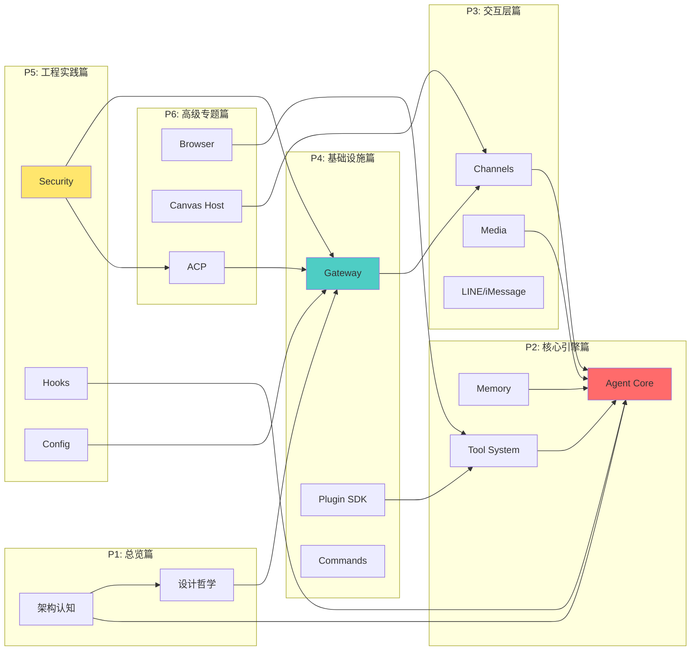

# OpenClaw Deep Dive

## 六大部分导航

## 快速开始

本文档基于 OpenClaw 源码分析，所有结论均附带路径引用。

| 部分 | 内容 | 状态 |
|------|------|------|
| P1: 总览篇 | 架构认知、设计哲学 | 📝 规划中 |
| P2: 核心引擎篇 | Agent Core、Memory、Tool System | 📝 规划中 |
| P3: 交互层篇 | Channels、Media、LINE/iMessage | 📝 规划中 |
| P4: 基础设施篇 | Gateway、Plugin SDK、Commands | ✅ 已有 Gateway |
| P5: 工程实践篇 | Security、Hooks、Config | 📝 规划中 |
| P6: 高级专题篇 | Browser、Canvas Host、ACP | 📝 规划中 |

## 贡献指南

欢迎提交 PR 补充完善各章节内容。
