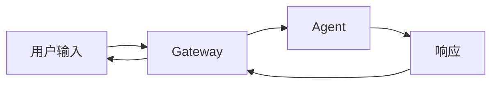

# 前言

> **OpenClaw 不是一个普通的聊天机器人框架，它是对 AI Agent 如何真正落地的深度探索。**

---

## 为什么需要这本书

2023 年，ChatGPT 横空出世，AI Agent 成为技术圈的焦点。无数团队涌入这个领域，但很快发现：**Demo 很容易，生产很难**。

- 消息发出去收不回来怎么办？
- 并发处理时状态怎么管理？
- 工具调用的权限怎么控制？
- 记忆系统怎么设计才高效？
- 多模型回退怎么实现？

这些问题没有标准答案。OpenAI 没有给你解决方案，LangChain 只是一个工具箱，不是系统蓝图。

**OpenClaw 是一个答案。**

它不是实验室里的玩具，而是经过 3 年迭代、处理过亿级消息的生产级系统。它的设计决策、权衡取舍、工程实践，都是用真实问题换来的。

这本书，就是要把这些经验体系化地传递给你。

---

## OpenClaw 的设计哲学

在深入细节之前，先理解 OpenClaw 的核心哲学：

### 1. 渐进复杂，简单起步

```
单会话 → 多会话 → 多租户 → 分布式
```

OpenClau 没有一开始就追求"完美架构"，而是从最简单的单会话开始，逐步演进。每个复杂度都是被真实需求推着增加的。

**启示**：不要过度设计。让架构跟随需求成长。

### 2. 分层解耦，清晰的边界

```
交互层 → 网关层 → 核心引擎层 → 能力层 → 基础设施层
```

每一层都有明确的职责，层与层之间通过清晰的接口通信。这让系统可以独立演进、独立测试。

**启示**：好的架构让改动局部化。

### 3. 可观测性优先

```
每个关键决策点都有日志
每个状态变化都有事件
每个错误都有根因
```

没有日志的系统是不可维护的。OpenClaw 在设计之初就把可观测性作为一等公民。

**启示**：可观测性不是事后补充，而是设计的一部分。

### 4. 安全默认，显式放行

```
默认拒绝 → 显式允许 → 最小权限
```

所有危险操作都需要显式授权，权限检查深入到每个执行点。

**启示**：安全不能妥协，默认策略应该最严格。

### 5. 失败是常态

```
LLM 会超时 → 工具会失败 → 网络会断开 → 进程会崩溃
```

系统不是假设"一切正常"，而是假设"一切可能出错"。每个关键路径都有降级方案。

**启示**：弹性比性能更重要。

---

## 这本书的核心价值

### 对 Agent 工程师

你将获得：
- **可复用的架构模式**：直接应用到你的项目
- **实战经验**：避免踩我们已经踩过的坑
- **设计思维**：学会如何设计可扩展的 Agent 系统

### 对架构师

你将理解：
- **大型 AI 系统的架构设计**：如何组织 50+ 万行代码
- **技术选型的权衡**：每个决策背后的思考
- **演进路径**：从原型到生产的架构演进

### 对 AI 行业工程师

你将看到：
- **工程化的方法论**：AI 技术如何变成产品
- **系统视角**：跳出单点技术，理解完整系统
- **前沿实践**：Agent 领域的最新工程实践

---

## 如何阅读本书

### 阅读路径

#### 路径一：快速入门（5-8小时）

```
第1章：架构总览
↓
第4章：Agent 核心
↓
第13章：渠道层
↓
第21章：Gateway
↓
第29章：安全策略
```

适合：快速了解 OpenClaw 全貌，判断是否适用

#### 路径二：深度学习（15-20小时）

```
按顺序阅读全部章节 + 完成思考题
```

适合：系统掌握 OpenClaw 架构，成为专家

#### 路径三：专题突破（按需选择）

```
第二部分（核心引擎）→ 对应实战案例 → 第六部分（高级专题）
```

适合：特定领域深入研究

#### 路径四：问题解决

```
术语表/索引 → 相关章节 → 实战案例 → ADR
```

适合：解决具体技术问题

### 阅读建议

1. **不要跳过架构图**：每章的开头都有架构图，先看图再读文字
2. **关注"为什么"**：理解设计决策比记住实现细节更重要
3. **对照代码阅读**：关键代码片段可以对照源码理解
4. **完成思考题**：每章后面的思考题是检验理解的最佳方式
5. **关注实战案例**：案例展示了理论如何转化为实践

### 前置知识

阅读本书需要：
- **编程基础**：熟悉 TypeScript/JavaScript
- **系统设计**：了解基本的设计模式和架构概念
- **AI 基础**：理解 LLM、Embedding、向量数据库等概念
- **工程经验**：最好有 2+ 年的软件开发经验

不需要：
- OpenClaw 使用经验
- 深度学习专业知识
- 分布式系统背景

---

## 本书的组织结构

全书分为六大部分，共 44 章：

### 第一部分：总览篇（第1-3章）

建立对 OpenClaw 的整体认知，理解设计哲学和技术栈。

### 第二部分：核心引擎篇（第4-12章）

深入 Agent 的"大脑"，理解记忆、工具、上下文管理。

### 第三部分：交互层篇（第13-20章）

理解 OpenClaw 如何与各种渠道交互，处理多媒体。

### 第四部分：基础设施篇（第21-28章）

掌握网关、插件、命令系统等基础设施。

### 第五部分：工程实践篇（第29-35章）

学习安全、配置、测试等工程实践。

### 第六部分：高级专题篇（第36-44章）

探索浏览器自动化、画布系统、控制平面等高级主题。

### 附录

- 术语表：100+ 核心术语
- 架构决策记录（ADR）：30+ 关键决策
- 代码索引：快速定位代码
- 思考题：检验理解
- 参考资料：延伸阅读

---

## 本书的约定

### 代码约定

```typescript
// 代码片段会标注文件路径
// src/agents/core.ts:123-145

// 关键代码会有注释说明
function processMessage(msg: Message): Promise<Response> {
  // 1. 验证消息格式
  // 2. 检查发送权限
  // 3. 构建上下文
  // ...
}

// 省略部分用 ... 表示
const config = {
  enabled: true,
  // ... 其他配置
};
```

### 图表约定



所有架构图使用 Mermaid 语法，可以在线渲染。

### 版本约定

本书基于 OpenClaw v2026.3.x 编写。不同版本之间可能存在差异，请以官方文档为准。

---

## 致谢

OpenClaw 是一个社区项目，这本书也是。

感谢 OpenClaw 核心团队的每一位贡献者，是你们的智慧和汗水打造了这个系统。

感谢早期用户，是你们的问题和反馈推动了 OpenClaw 的演进。

感谢 AI Agent 社区，是你们的探索和分享让这个行业快速进步。

特别感谢：

- **Peter**：OpenClaw 的创建者，设计了系统的核心架构
- **贡献者列表**：(GitHub 贡献者，按 commit 数排序)
- **早期用户**：在产品还不完善时就选择相信我们

---

## 关于作者

**Leon** 是 OpenClaw 项目的深度参与者和架构文档作者。

作为技术架构师，Leon 相信：
> **好的架构不是复杂的架构，而是恰到好处的架构。简单是不够的，要追求极致的简洁。**

Leon 的技术博客：[待定]
GitHub：[待定]

---

## 反馈与贡献

如果你在阅读过程中有任何问题或建议：

- **提交 Issue**：GitHub Issues
- **发送邮件**：[待定]
- **加入社区**：Discord/Slack

欢迎贡献：
- 纠正错误
- 补充案例
- 改进表达
- 翻译版本

---

## 许可证

本书采用 CC BY-NC-SA 4.0 许可证。

你可以：
- ✅ 分享：以任何媒介或格式复制
- ✅ 适应： remix、变换和构建

只要你：
- ⚠️ 归属：给出适当的署名
- ⚠️ 非商业：不得用于商业目的
- ⚠️ 相同方式：以相同的许可证分享

---

## 版本历史

| 版本 | 日期 | 变更 |
|------|------|------|
| 1.0.0 | 2026-03-12 | 首次发布 |

---

**现在，让我们开始这段探索之旅。**

目录 → 第1章：OpenClaw 架构总览
